# Execução V1 — Testes Exploratórios
## CT-E01 — Aplicar cupom e depois aumentar a quantidade de um produto
### Resultado UI
**Status:** ✅ PASSOU
Durante a exploração do cenário, o sistema apresentou comportamento consistente com a expectativa definida para o teste, sem divergências identificadas na interface.
**Evidência:**
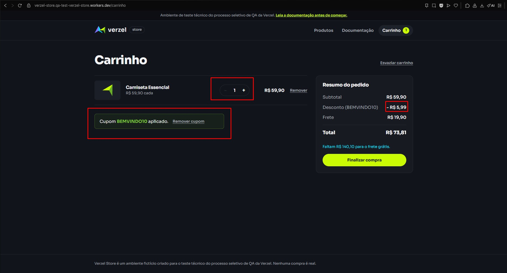
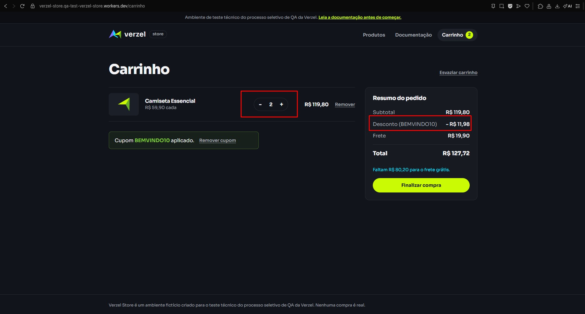
### Resultado API
**Status:** ✅ PASSOU
A API apresentou comportamento consistente com o observado na interface e com a expectativa definida para o cenário exploratório.
**Evidência:**
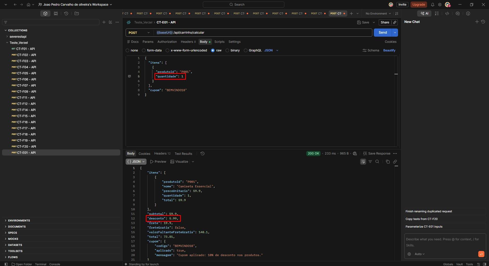
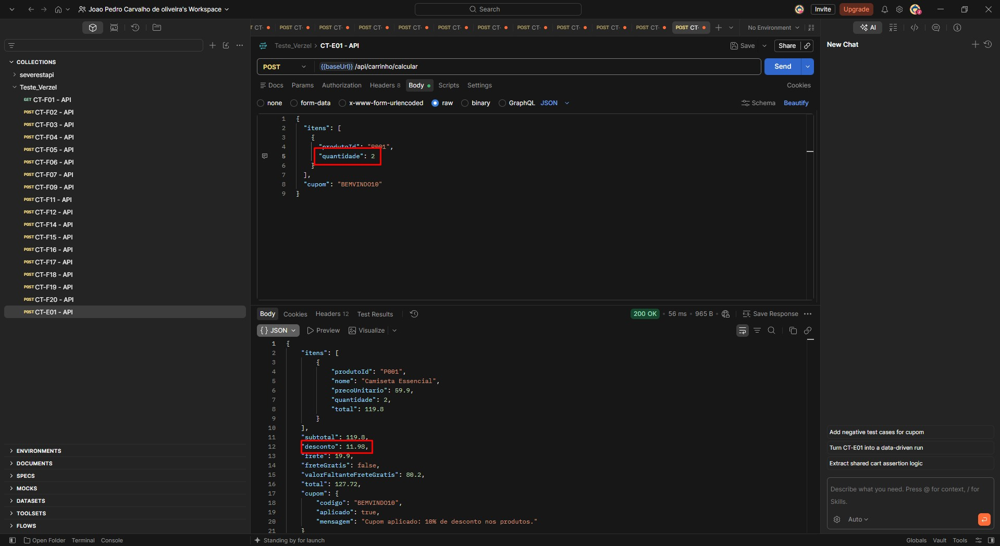
### Observações
Nenhuma divergência encontrada durante a exploração do cenário.
---
## CT-E02 — Aplicar cupom e depois diminuir a quantidade
### Resultado UI
**Status:** ✅ PASSOU
Durante a exploração do cenário, ao reduzir a quantidade de um produto após a aplicação do cupom `BEMVINDO10`, o sistema recalculou corretamente os valores do carrinho e manteve o desconto de forma consistente.
**Evidência:**
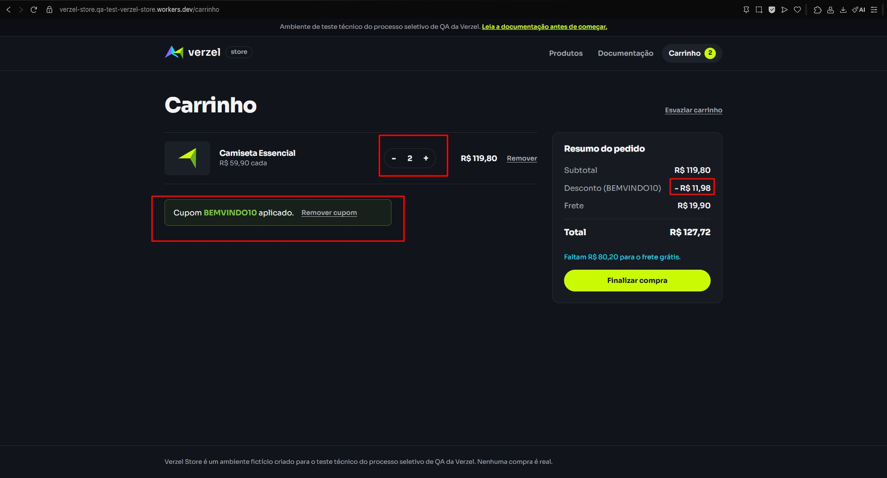

### Resultado API
**Status:** ✅ PASSOU
A API recalculou corretamente o carrinho após a redução da quantidade do produto, mantendo o desconto do cupom de forma consistente com o novo subtotal.
**Evidência:**
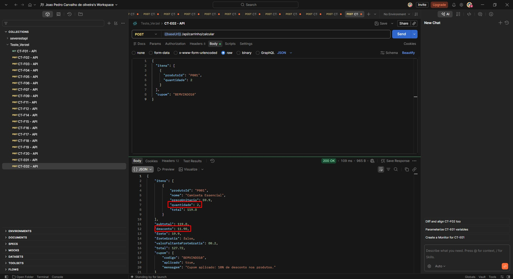
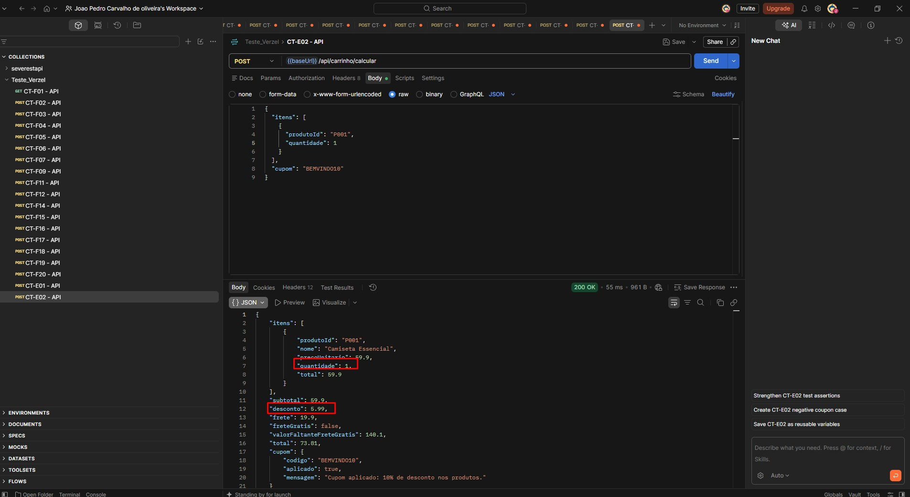
### Observações
Nenhuma divergência encontrada durante a exploração do cenário.
---
## CT-E03 — Remover um produto após aplicar o cupom
### Resultado UI
**Status:** ✅ PASSOU
Durante a exploração do cenário, após a remoção de um dos produtos do carrinho, o sistema recalculou corretamente os valores e manteve o cupom `BEMVINDO10` aplicado sobre o novo subtotal.
**Evidência:**
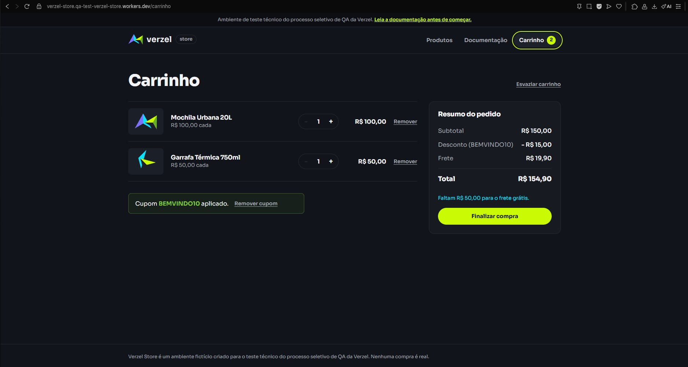
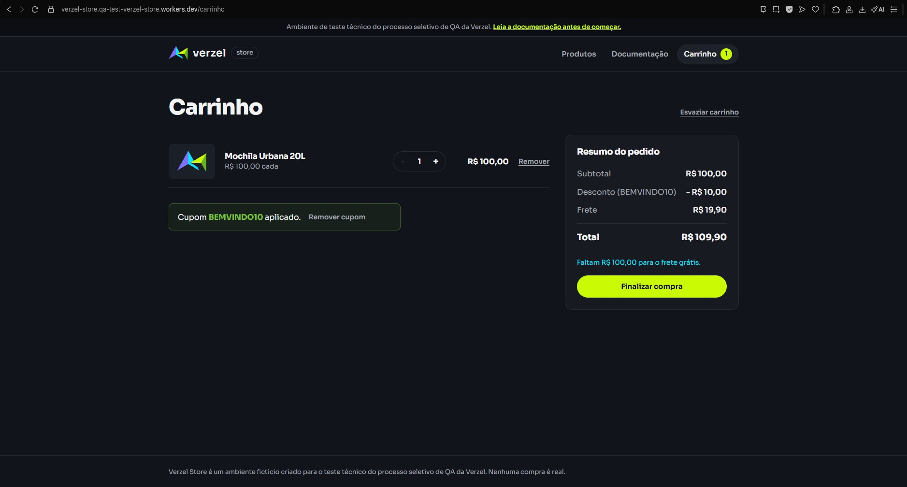
### Resultado API
**Status:** ✅ PASSOU
A API recalculou corretamente o carrinho após a remoção de um dos produtos, mantendo o cupom aplicado e ajustando subtotal, desconto, frete e total de forma consistente.
**Evidência:**
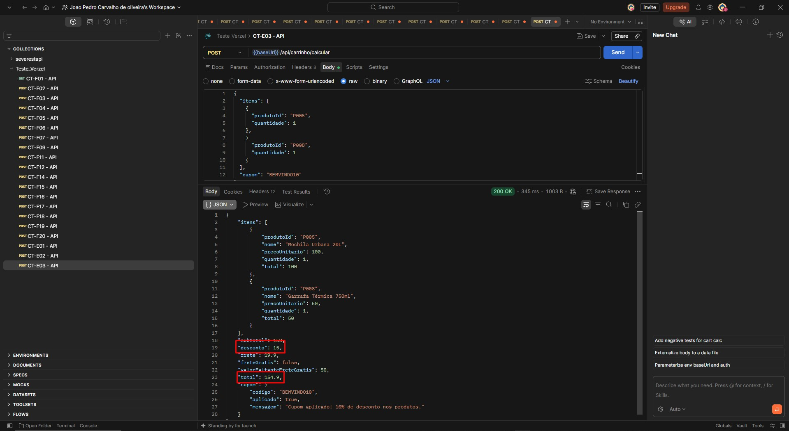
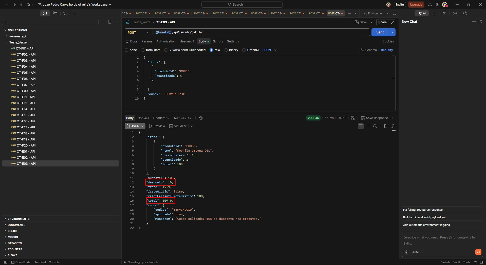
### Observações
Nenhuma divergência encontrada durante a exploração do cenário.
---
## CT-E04 — Perder o frete grátis após reduzir o carrinho abaixo de R$ 200,00
### Resultado UI
**Status:** ✅ PASSOU
Durante a exploração do cenário, o carrinho iniciou com subtotal superior a R$ 200,00 e frete grátis aplicado.
Após a redução do valor do carrinho para um subtotal inferior a R$ 200,00, o sistema recalculou corretamente o frete, passando a cobrar R$ 19,90 e atualizando o valor faltante para atingir novamente o frete grátis.
**Evidência:**
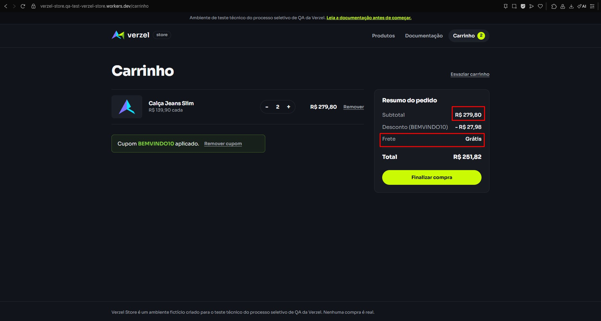

### Resultado API
**Status:** ✅ PASSOU
A API apresentou comportamento consistente com a interface. Ao calcular inicialmente um carrinho elegível ao frete grátis e, posteriormente, um carrinho com subtotal inferior a R$ 200,00, o frete foi recalculado corretamente para R$ 19,90.
**Evidência:**
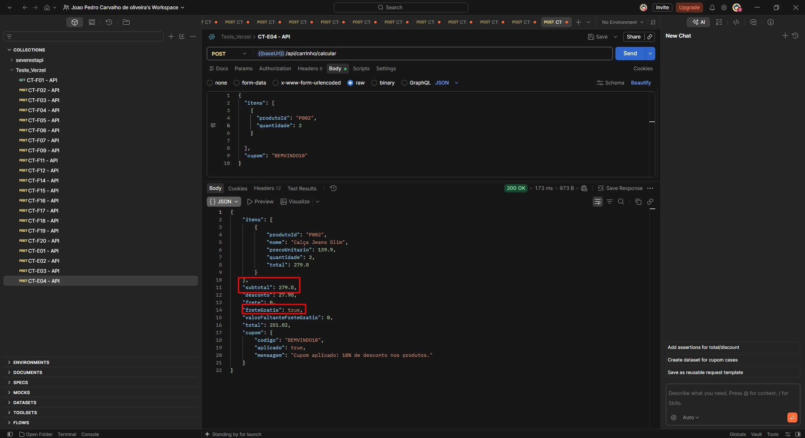
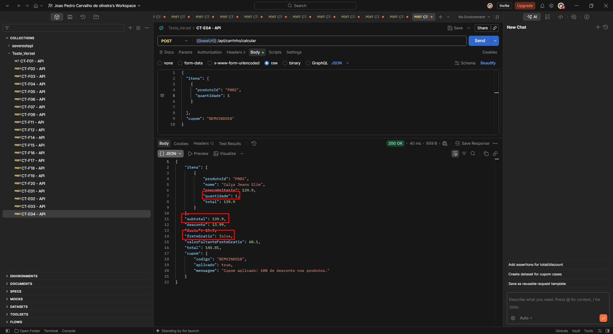
### Observações
Durante a preparação do cenário, foi considerado o comportamento já identificado nos testes funcionais para subtotal exatamente igual a R$ 200,00, em que o sistema mantém indevidamente a cobrança de frete.
Para evitar que essa divergência conhecida interferisse no objetivo específico do CT-E04, o cenário foi executado inicialmente com subtotal superior a R$ 200,00.
Dessa forma, foi possível validar isoladamente a transição de frete grátis para frete pago após a redução do valor do carrinho.
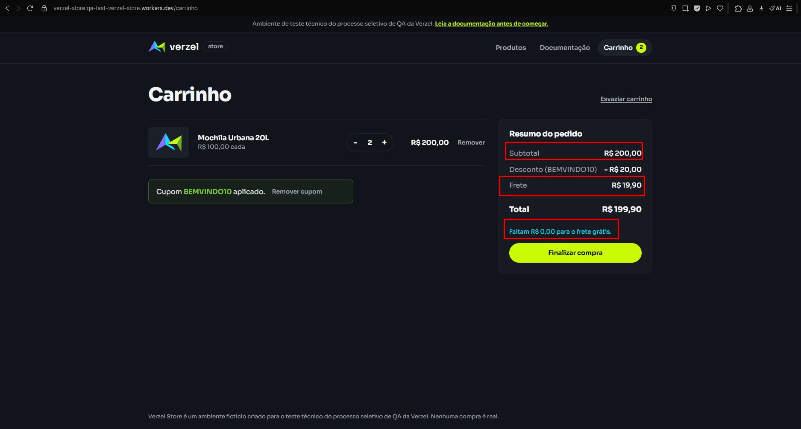
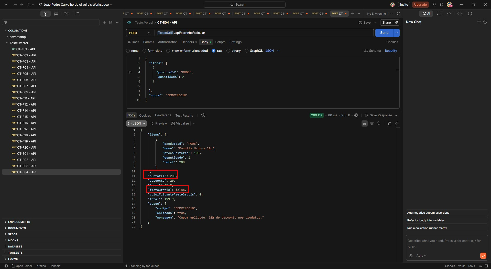
---
## CT-E05 — Ganhar frete grátis após aumentar o carrinho
### Resultado UI
**Status:** ✅ PASSOU
Durante a exploração do cenário, o carrinho iniciou com subtotal inferior a R$ 200,00 e cobrança de frete de R$ 19,90.
Após o aumento do valor do carrinho para um subtotal superior ao limite de frete grátis, o sistema recalculou corretamente os valores e removeu a cobrança do frete.
**Evidência:**
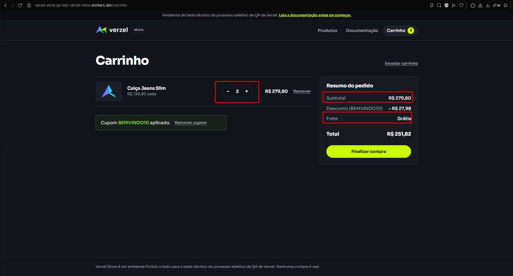
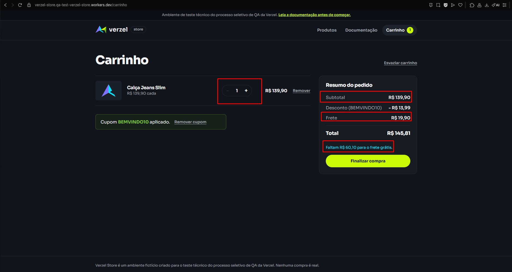
### Resultado API
**Status:** ✅ PASSOU
O comportamento esperado para este cenário já foi validado pelas requisições utilizadas no CT-E04.
Na execução daquele cenário foram realizados cálculos com carrinhos abaixo e acima do limite de R$ 200,00, permitindo confirmar que a API aplica corretamente o frete grátis quando o subtotal ultrapassa o valor mínimo exigido.
Por esse motivo, a mesma evidência de API do CT-E04 também valida o comportamento esperado para o CT-E05.
### Observações
Nenhuma nova divergência foi encontrada durante a exploração do cenário.
---
## CT-E06 — Remover e reaplicar o mesmo cupom
### Resultado UI
**Status:** ✅ PASSOU
Durante a exploração do cenário, o cupom `BEMVINDO10` foi removido do carrinho e posteriormente reaplicado com sucesso.
Após a reaplicação, o sistema voltou a considerar corretamente o desconto sobre o subtotal dos produtos, sem apresentar inconsistências no estado do carrinho.
### Observações
Nenhuma divergência encontrada durante a exploração do cenário.
Não foi anexada evidência visual para este teste, pois imagens estáticas não demonstrariam de forma adequada a alteração de estado entre a remoção e a reaplicação do cupom.
A validação foi realizada acompanhando o comportamento do carrinho durante toda a sequência de ações.
---
## CT-E07 — Tentar aplicar o cupom repetidamente
### Resultado UI
**Status:** ✅ PASSOU
Durante a exploração do cenário, foi verificado que o botão de aplicação do cupom permite apenas uma ação por vez.
Após o cupom `BEMVINDO10` ser aplicado com sucesso, a interface altera o estado do componente e impede novos acionamentos indevidos para a mesma aplicação.
Esse comportamento reduz a possibilidade de envio repetido de requisições e evita o processamento duplicado da mesma ação.
### Observações
Nenhuma divergência encontrada durante a exploração do cenário.
Não foi anexada evidência visual, pois uma imagem estática não demonstraria adequadamente o bloqueio de múltiplos acionamentos do botão.
A validação foi realizada por meio da interação direta com o componente durante a execução do teste.
---
## CT-E08 — Realizar alterações rápidas de quantidade no carrinho
### Resultado UI
**Status:** ✅ PASSOU
Durante a exploração do cenário, as alterações de quantidade foram processadas corretamente pela interface.
O controle de quantidade permite apenas uma interação por ação e o carrinho é atualizado imediatamente após cada alteração, mantendo subtotal, desconto, frete e total consistentes com o novo estado.
### Observações
Nenhuma divergência encontrada durante a exploração do cenário.
Não foi anexada evidência visual, pois imagens estáticas não demonstrariam adequadamente a sequência e a atualização imediata do estado do carrinho.
A validação foi realizada acompanhando o comportamento da interface durante as alterações de quantidade.
---
## CT-E09 — Validar persistência do cupom após esvaziar o carrinho
### Resultado UI
**Status:** ❌ FALHOU
Durante a exploração do cenário, o cupom `BEMVINDO10` foi aplicado normalmente ao carrinho.
Em seguida, todos os produtos foram removidos, deixando o carrinho completamente vazio.
Ao adicionar um novo produto e iniciar novamente a montagem do carrinho, o cupom utilizado anteriormente permaneceu salvo e foi reaplicado automaticamente, sem uma nova ação do usuário.
### Resultado API
**Status:** ✅ PASSOU
A API não mantém estado entre as requisições. Cada chamada informa explicitamente os itens e, opcionalmente, o cupom que deve ser utilizado.
Dessa forma, não foi observada persistência automática de cupom na API, pois uma nova requisição sem o campo `cupom` é processada sem desconto.
### Observações
Não foi anexada evidência visual, pois imagens estáticas não demonstrariam adequadamente a sequência de esvaziar o carrinho e iniciar uma nova sacola.
A validação foi realizada acompanhando todo o fluxo de interação na interface.
A documentação não define explicitamente se o cupom deve permanecer aplicado após o carrinho ser completamente esvaziado. Por esse motivo, o comportamento foi registrado como uma divergência encontrada durante o teste exploratório, sem classificá-lo automaticamente como defeito de regra de negócio.
---
## CT-E10 — Validar diferentes combinações de produtos e quantidades
### Resultado UI
**Status:** ✅ PASSOU
Durante a exploração do cenário, foram adicionados diferentes produtos ao carrinho com quantidades variadas.
O sistema recalculou corretamente o subtotal, o desconto aplicado pelo cupom `BEMVINDO10`, o frete e o valor total do carrinho, mantendo consistência entre os itens selecionados e os valores apresentados.
**Evidência:**
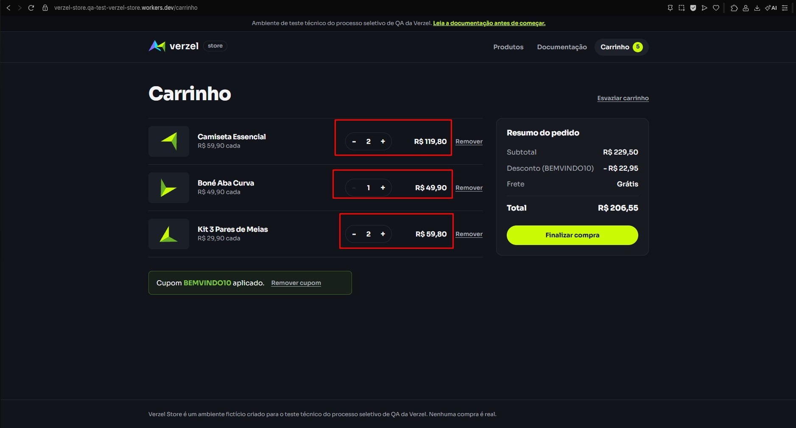
### Resultado API
**Status:** ✅ PASSOU
A API processou corretamente a combinação de múltiplos produtos e quantidades diferentes.
Foram validados os cálculos de subtotal, desconto, frete grátis e total final, com resultados consistentes com os valores observados na interface.
**Evidência:**
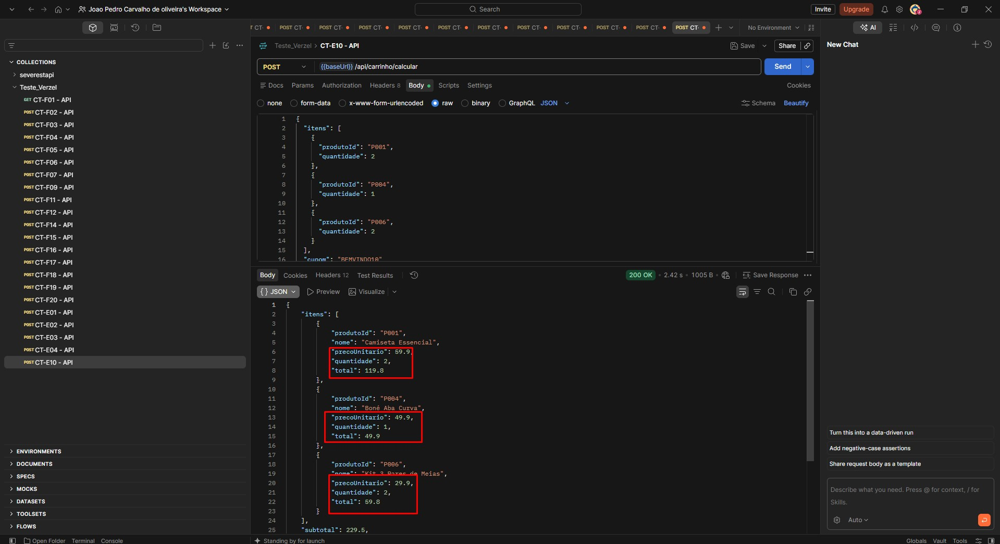
### Observações
Nenhuma divergência encontrada durante a exploração do cenário.
---
## CT-E11 — Explorar combinações de valores e arredondamento
### Resultado UI
**Status:** ✅ PASSOU
Durante a exploração do cenário, foram utilizadas combinações de produtos que resultaram em valores com centavos para validar a consistência dos cálculos monetários apresentados no carrinho.
O sistema apresentou subtotal, desconto, frete, valor faltante para frete grátis e total de forma consistente com os cálculos esperados.
**Evidência:**
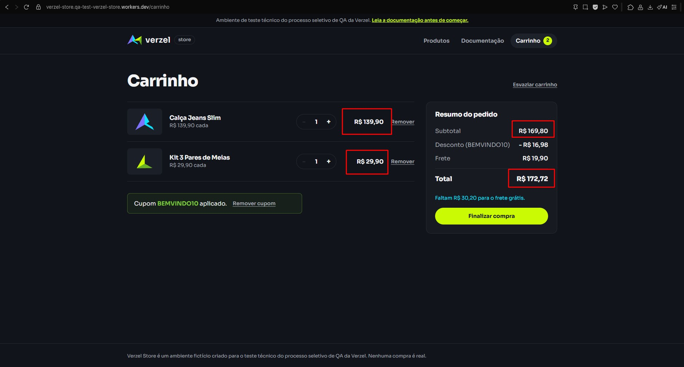
### Resultado API
**Status:** ✅ PASSOU
A API calculou corretamente os valores do carrinho, mantendo consistência entre subtotal, desconto aplicado pelo cupom, frete, valor faltante para frete grátis e total final.
Os valores retornados ficaram compatíveis com os cálculos realizados manualmente e com os resultados apresentados na interface.
**Evidência:**
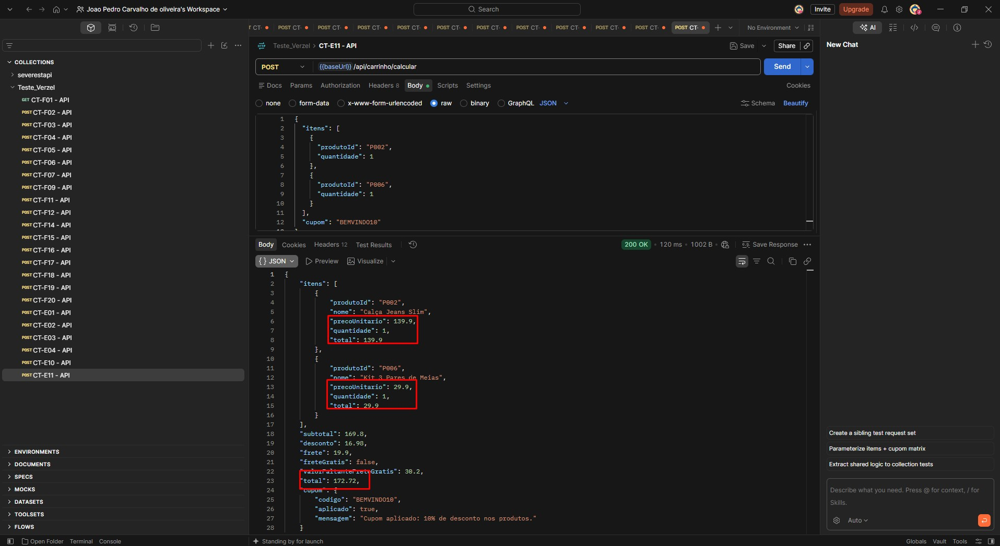
### Observações
Nenhuma divergência encontrada durante a exploração do cenário.
Com a massa de dados disponibilizada, não foi possível gerar naturalmente um cálculo que resultasse em três ou mais casas decimais. Por esse motivo, o cenário validou a consistência dos valores monetários com duas casas decimais, mas não um arredondamento real a partir de uma terceira casa decimal.
---
## CT-E12 — Comparar diretamente o mesmo carrinho entre UI e API
### Resultado UI
**Status:** ✅ PASSOU
Durante a exploração do cenário, foi montado um carrinho na interface e seus valores foram registrados para comparação direta com o cálculo realizado pela API.
Subtotal, desconto, frete, valor faltante para frete grátis e total apresentaram resultados consistentes com a composição do carrinho.
**Evidência:**
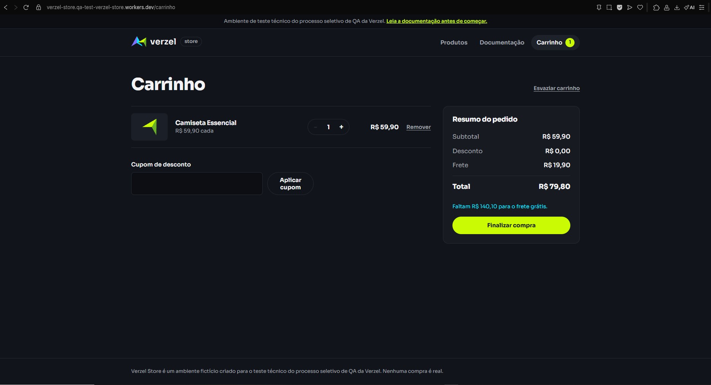
### Resultado API
**Status:** ✅ PASSOU
A mesma composição de produtos, quantidades e cupom utilizada na interface foi enviada para a API.
Os valores retornados pela API ficaram consistentes com os apresentados na UI, sem divergências entre as duas camadas.
**Evidência:**
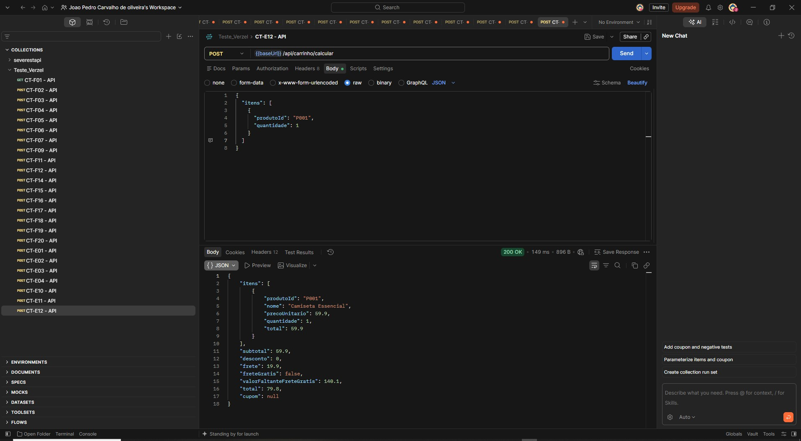
### Observações
Nenhuma divergência encontrada durante a comparação direta entre UI e API.
---
## CT-E13 — Explorar o limite de quantidade por produto
### Resultado UI
**Status:** ✅ PASSOU
Durante a exploração do limite de quantidade, a interface permitiu normalmente a alteração de 4 para 5 unidades e bloqueou a tentativa de ultrapassar o limite máximo permitido.
Ao retornar para 5 unidades, o carrinho continuou funcionando normalmente e os valores foram recalculados de forma consistente.
### Resultado API
**Status:** ❌ FALHOU
Ao reproduzir o limite de quantidade diretamente pela API, foi novamente observado que uma requisição com quantidade superior a 5 unidades é aceita e processada normalmente.
Esse comportamento diverge da regra de negócio, que define o limite máximo de 5 unidades por produto também para a API.
**Evidência:**
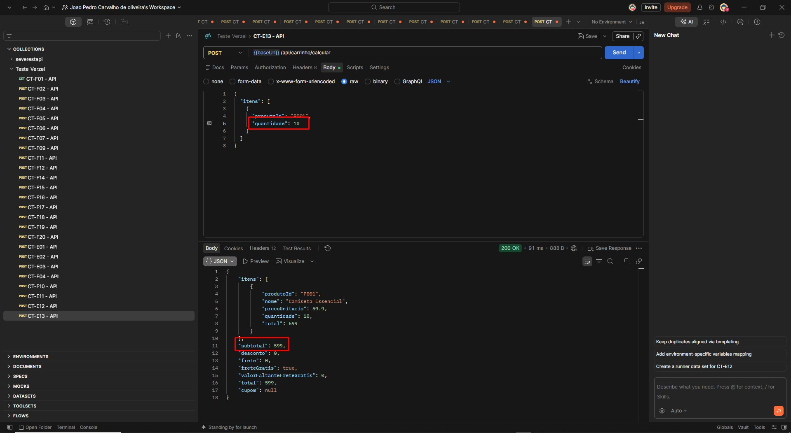
### Observações
A divergência encontrada neste cenário já havia sido identificada e documentada anteriormente no teste funcional `CT-F17`.
O CT-E13 confirmou, por meio de uma exploração do limite de quantidade, que a interface aplica corretamente a restrição, enquanto a API continua permitindo valores superiores ao máximo definido.
O comportamento foi registrado neste cenário apenas como reprodução de uma divergência já conhecida, não como uma nova ocorrência independente.
---
## CT-E14 — Explorar formatos alternativos do código do cupom
### Resultado UI
**Status:** ✅ PASSOU
Durante a exploração do cenário, foi utilizado o código `bem vindo10`, contendo um espaço no meio do cupom.
A interface reconheceu o código como inválido e não aplicou desconto ao carrinho.
**Evidência:**
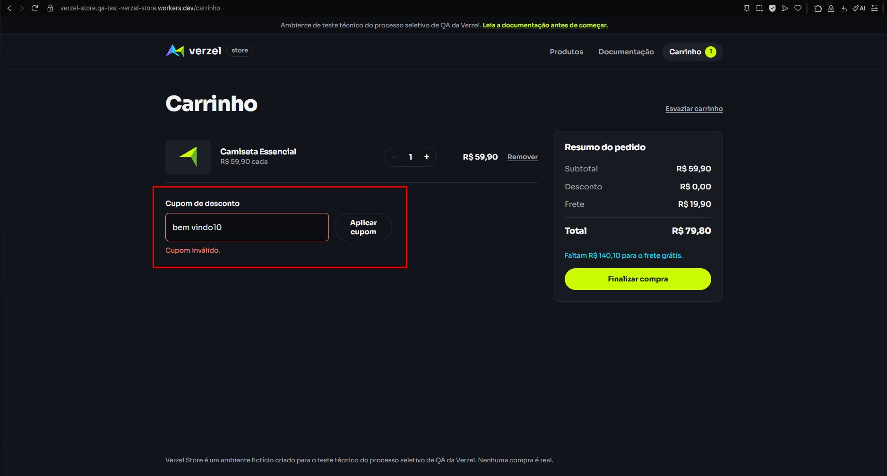
### Resultado API
**Status:** ✅ PASSOU
A mesma entrada `bem vindo10` foi enviada para a API.
A API também tratou o código como inválido e não aplicou desconto, apresentando comportamento consistente com a interface.
**Evidência:**
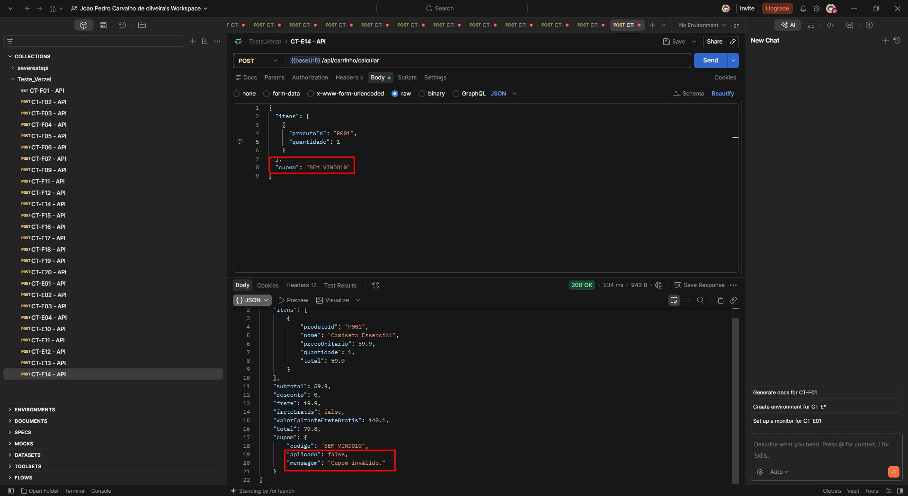
### Observações
O cenário foi executado utilizando um espaço interno no código do cupom com o objetivo de complementar a validação da regra de tratamento de espaços.
A documentação determina que espaços no início e no fim do código devem ser ignorados, comportamento já validado anteriormente nos testes funcionais.
Neste teste exploratório, foi verificado se a mesma tolerância seria aplicada a espaços inseridos no meio do código. Tanto a UI quanto a API consideraram `bem vindo10` inválido.
Como a documentação não determina que espaços internos devam ser ignorados, o comportamento observado não foi considerado uma divergência.
---
## CT-E15 — Aplicar cupom com o carrinho vazio
### Resultado UI
**Status:** ✅ PASSOU
Durante a exploração do cenário, foi realizada uma tentativa de aplicação do cupom `BEMVINDO10` com o carrinho vazio.
A interface tratou corretamente a situação e não apresentou comportamento inconsistente durante a tentativa de aplicação do cupom sem produtos adicionados.
**Evidência:**

### Resultado API
**Status:** ✅ PASSOU
Foi enviada uma requisição com a lista de itens vazia e o cupom `BEMVINDO10`.
A API retornou corretamente o erro referente à ausência de itens no carrinho, impedindo o cálculo antes da aplicação do cupom.
**Evidência:**
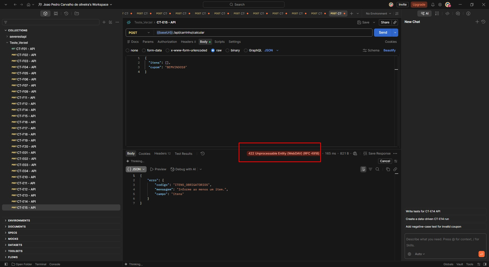
### Observações
Nenhuma divergência encontrada durante a exploração do cenário.
Na API, o comportamento observado confirma que um carrinho vazio é rejeitado antes do processamento do cupom, mantendo a validação coerente com a regra de obrigatoriedade dos itens.
---