# Execução V1 — Testes Funcionais
## CT-F01 — Aplicar cupom válido BEMVINDO10
### Resultado UI
**Status:** ✅ PASSOU
O cupom `BEMVINDO10` foi reconhecido como válido e aplicado corretamente, com o desconto exibido conforme esperado.
**Evidência:**

### Resultado API
**Status:** ✅ PASSOU
A API reconheceu e aplicou corretamente o cupom `BEMVINDO10`.
**Evidência:**
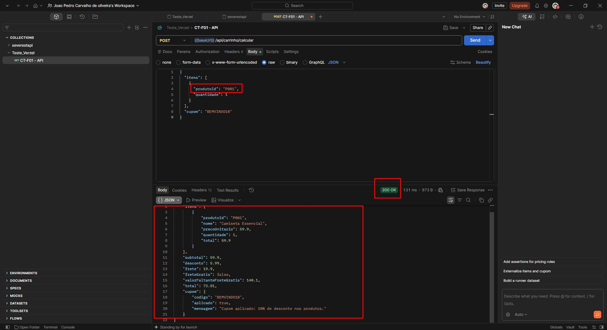
### Observações
Nenhuma divergência encontrada.
---
## CT-F02 — Validar o cálculo de 10% de desconto sobre o subtotal
### Resultado UI
**Status:** ✅ PASSOU
O cupom `BEMVINDO10` foi aplicado corretamente e o desconto de 10% sobre o subtotal foi calculado conforme esperado.
**Evidência:**
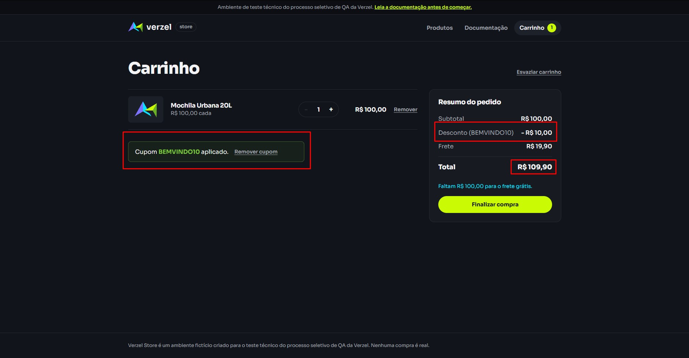
### Resultado API
**Status:** ✅ PASSOU
A API calculou corretamente o desconto de 10% sobre o subtotal dos produtos.
**Evidência:**
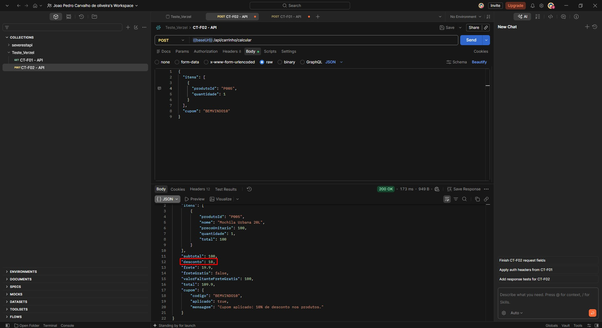
### Observações
Durante a execução foi identificada uma inconsistência relacionada ao cálculo do frete.
Para um carrinho com subtotal de R$ 200,00 e aplicação do cupom `BEMVINDO10`, o desconto de 10% foi calculado corretamente em R$ 20,00.
Entretanto, tanto a interface quanto a API mantiveram a cobrança de R$ 19,90 de frete, mesmo com `valorFaltanteFreteGratis` igual a 0.
O comportamento será validado especificamente nos cenários CT-F11 e CT-F14.
---
## CT-F03 — Aplicar bemvindo10 em letras minúsculas
### Resultado UI
**Status:** ✅ PASSOU
O cupom `bemvindo10` foi reconhecido como válido e aplicado corretamente, mesmo sendo informado integralmente em letras minúsculas.
**Evidência:**
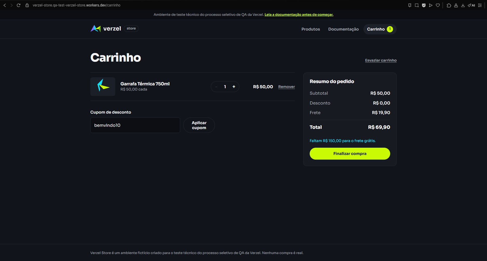

### Resultado API
**Status:** ✅ PASSOU
A API reconheceu e aplicou corretamente o cupom `bemvindo10` informado em letras minúsculas.
**Evidência:**
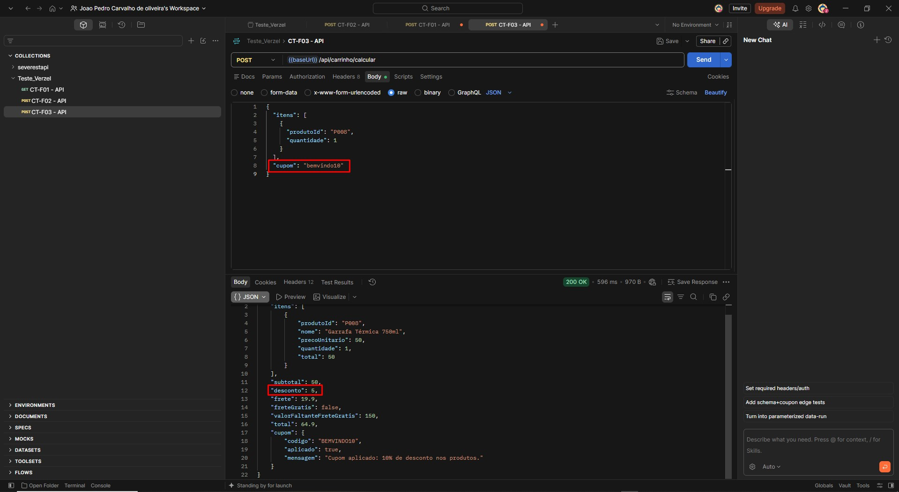
### Observações
Nenhuma divergência encontrada.
---
## CT-F04 — Aplicar cupom com mistura de letras maiúsculas e minúsculas
### Resultado UI
**Status:** ✅ PASSOU
O cupom `BemVindo10` foi reconhecido como válido e aplicado corretamente, mesmo utilizando uma combinação de letras maiúsculas e minúsculas.
**Evidência:**
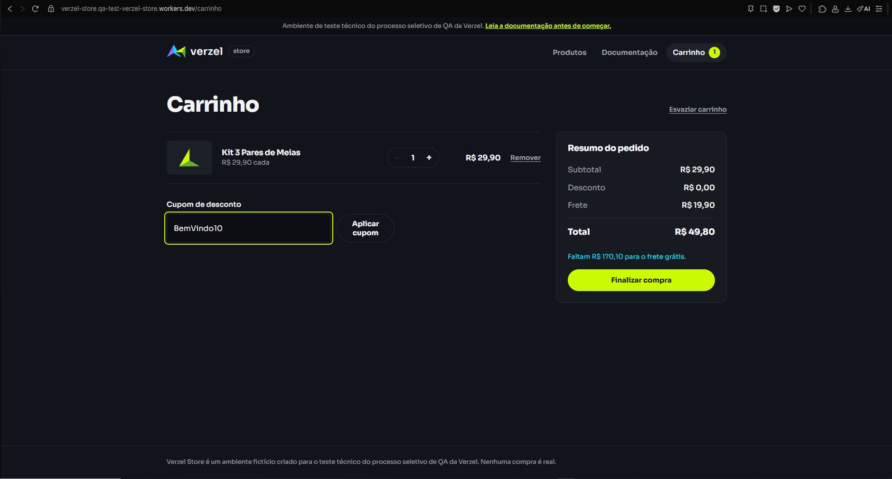
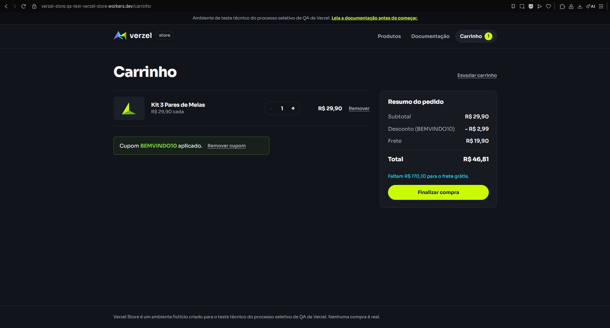
### Resultado API
**Status:** ✅ PASSOU
A API reconheceu e aplicou corretamente o cupom `BemVindo10` informado com combinação de letras maiúsculas e minúsculas.
**Evidência:**
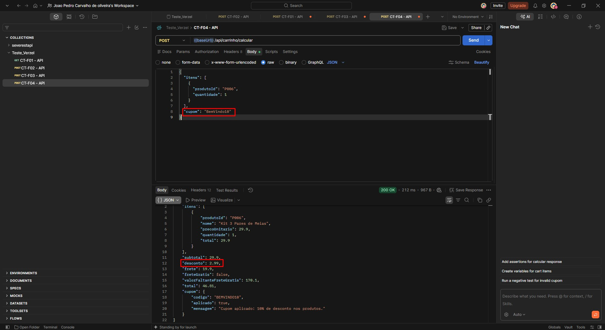
### Observações
Nenhuma divergência encontrada.
---
## CT-F05 — Aplicar cupom com espaços no início e no fim
### Resultado UI
**Status:** ✅ PASSOU
O cupom `  BemVindo10  ` foi reconhecido como válido e aplicado corretamente, ignorando os espaços adicionados no início e no fim do código.
**Evidência:**
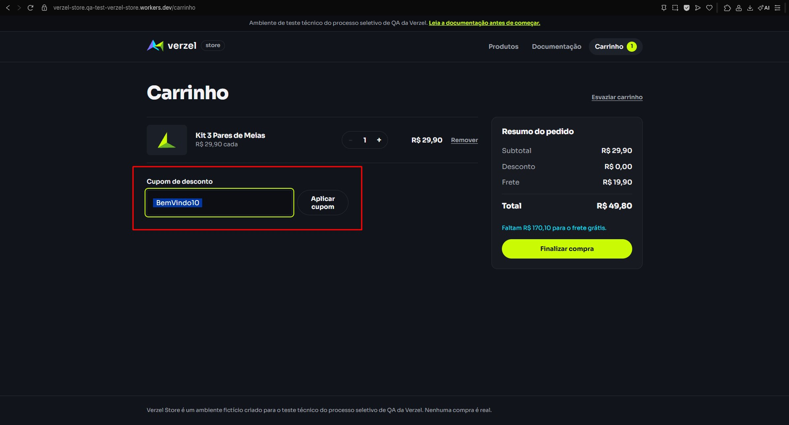
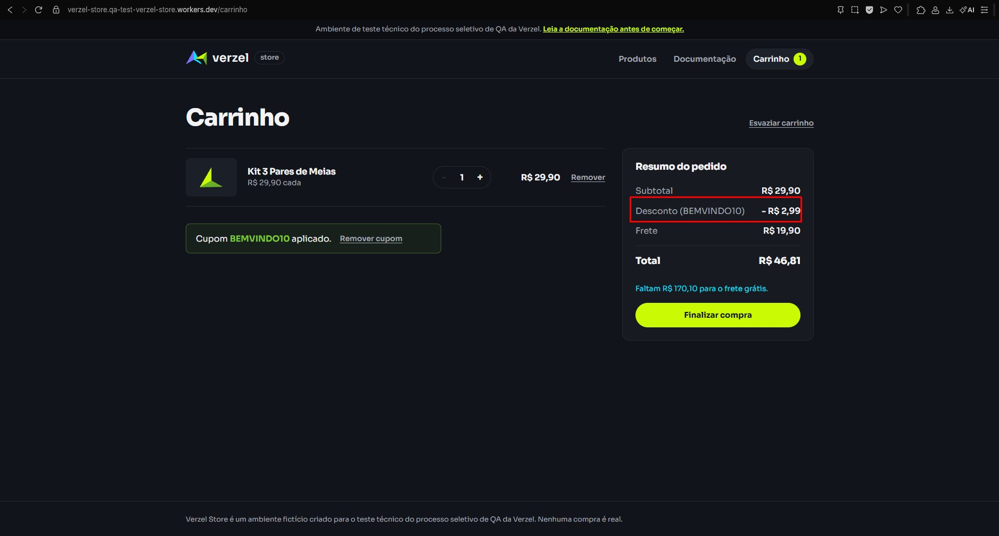
### Resultado API
**Status:** ✅ PASSOU
A API reconheceu e aplicou corretamente o cupom `  BemVindo10  `, ignorando os espaços no início e no fim do código.
**Evidência:**
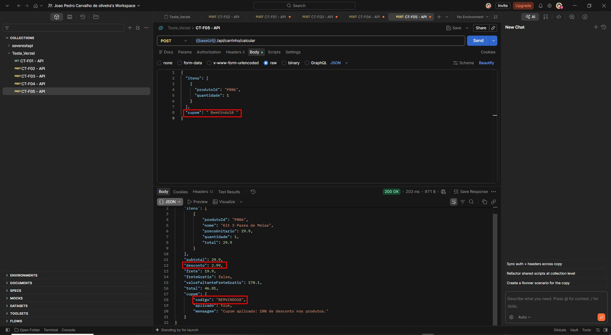
### Observações
Nenhuma divergência encontrada.
---
## CT-F06 — Aplicar um cupom inexistente
### Resultado UI
**Status:** ✅ PASSOU
O cupom `teste` foi reconhecido como inválido, nenhum desconto foi aplicado e a mensagem esperada foi apresentada.
**Evidência:**
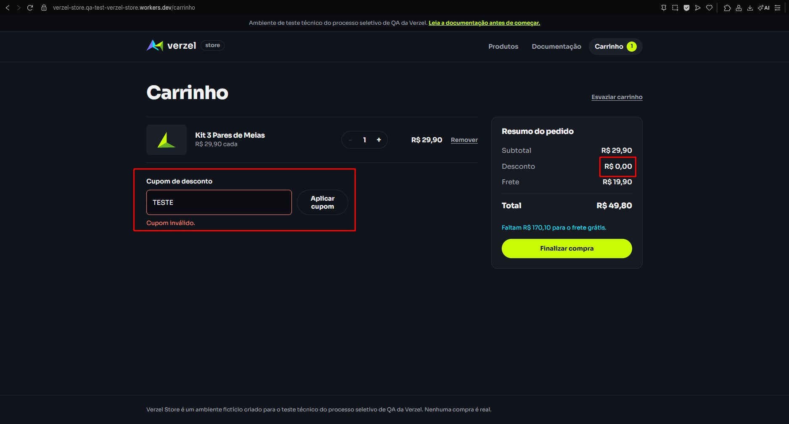
### Resultado API
**Status:** ✅ PASSOU
A API reconheceu o cupom `teste` como inválido e não aplicou desconto ao carrinho.
**Evidência:**
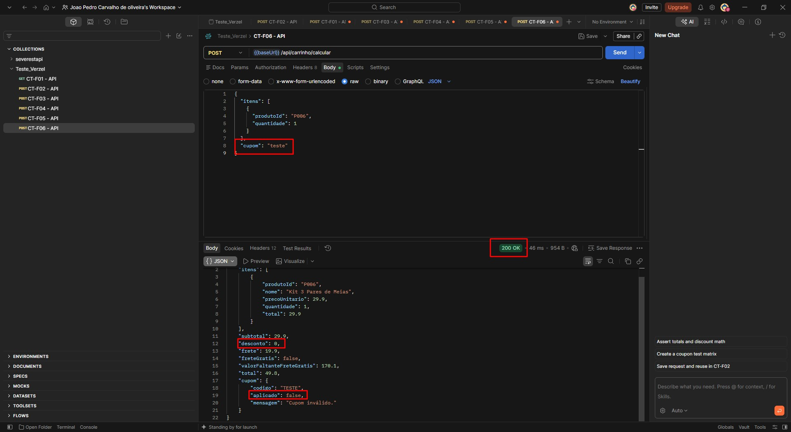
### Observações
Nenhuma divergência encontrada.
---
## CT-F07 — Aplicar o cupom expirado VERAO2026
### Resultado UI
**Status:** ✅ PASSOU
Os códigos `VERAO2026` e `verao2026` foram reconhecidos como referentes a um cupom expirado, sem aplicação de desconto.
**Evidência:**
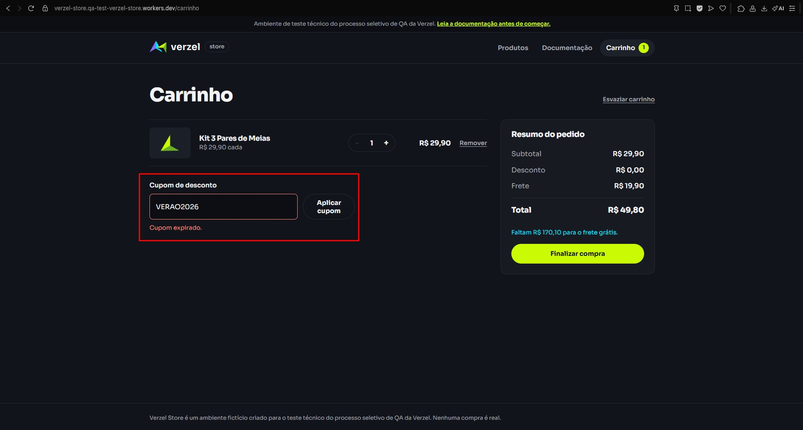

### Resultado API
**Status:** ✅ PASSOU
A API reconheceu corretamente `VERAO2026` e `verao2026` como referentes a um cupom expirado e não aplicou desconto.
**Evidência:**
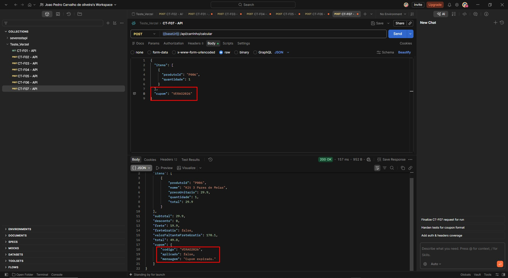
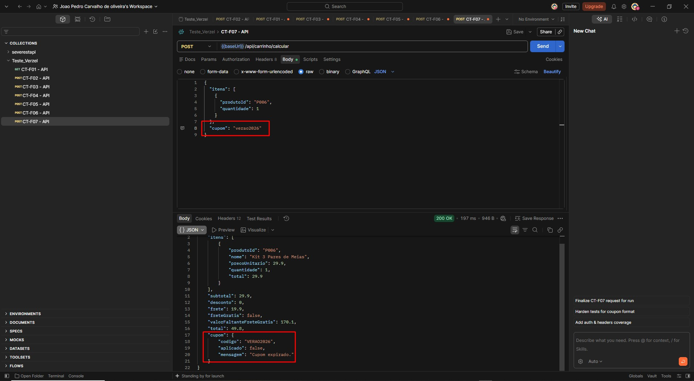
### Observações
Nenhuma divergência encontrada.
---
## CT-F08 — Tentar aplicar outro cupom enquanto já existe um aplicado
### Resultado UI
**Status:** ✅ PASSOU
O sistema impede corretamente a aplicação de um novo cupom enquanto outro cupom permanece aplicado no carrinho.
**Evidência:**
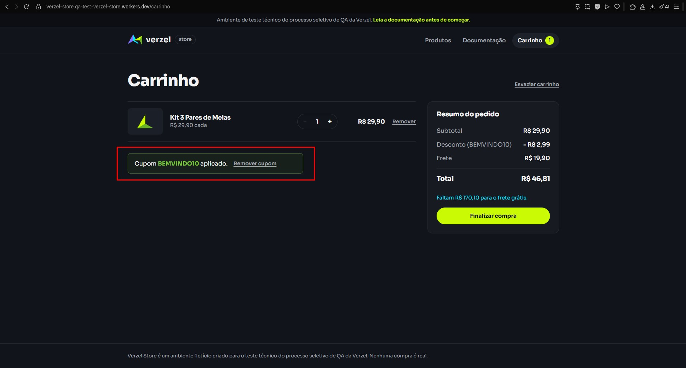
### Observações
Nenhuma divergência encontrada.
---
## CT-F09 — Remover o cupom atual e aplicar outro
### Resultado UI
**Status:** ✅ PASSOU
O sistema permitiu remover o cupom atualmente aplicado e informar um novo código. Como a documentação disponibiliza apenas um cupom válido, foi utilizado um cupom inválido para validar a troca após a remoção.
**Evidência:**

### Resultado API
**Status:** ✅ PASSOU
Após a remoção lógica do cupom da requisição, a API processou o carrinho sem cupom e também processou corretamente uma nova requisição contendo outro código de cupom.
**Evidência:**
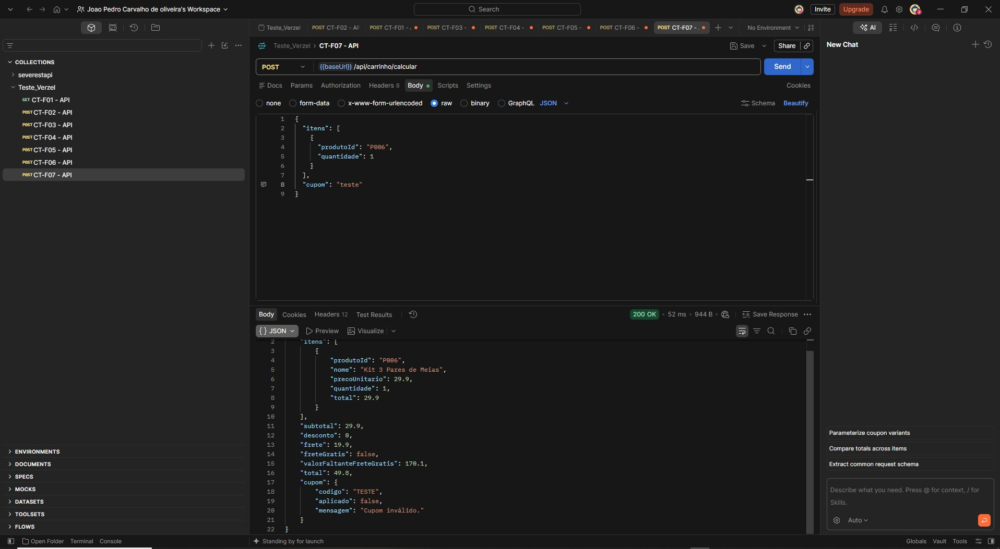
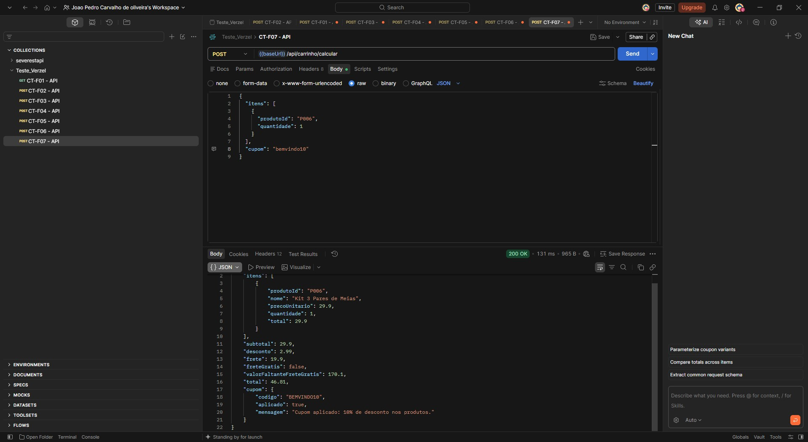
### Observações
Nenhuma divergência encontrada.
---
## CT-F10 — Carrinho com subtotal superior a R$ 200,00 - Verificar frete
### Resultado UI
**Status:** ✅ PASSOU
O sistema corretamente aplicou frete grátis para o produto superior a 200 reais.
**Evidência:**
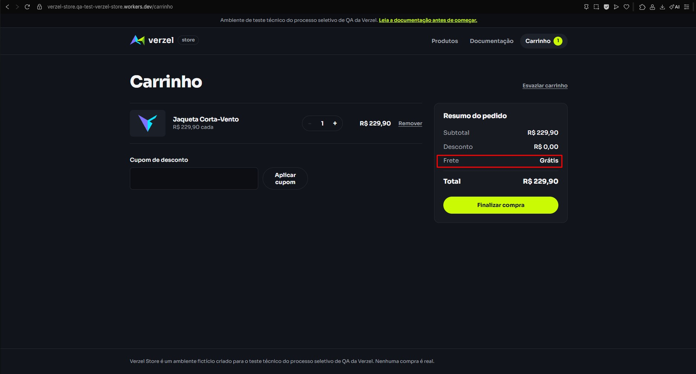
### Resultado API
**Status:** ✅ PASSOU
Após a inserção do P007, a API retornou o frete como grátis.
**Evidência:**
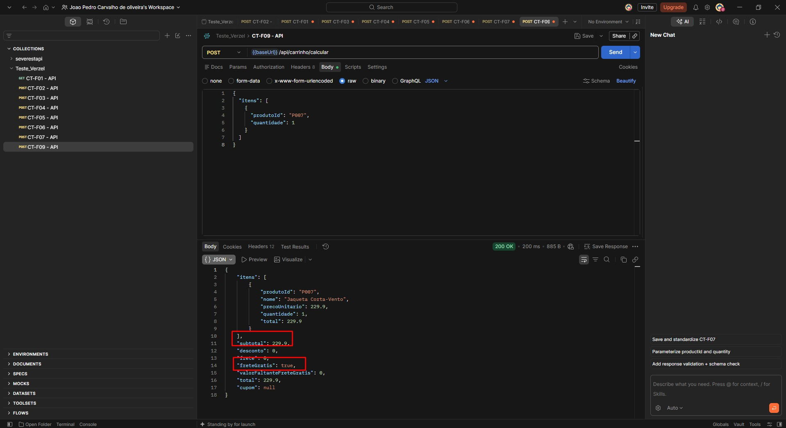
### Observações
Nenhuma divergência encontrada.
---
## CT-F11 — Carrinho com subtotal igual a R$ 200,00 - Verificar frete
### Resultado UI
**Status:** ❌ FALHOU
Com o carrinho totalizando subtotal de R$ 200,00, o sistema manteve a cobrança de frete de R$ 19,90, embora a regra determine frete grátis para valores a partir de R$ 200,00, inclusive.
**Evidência:**
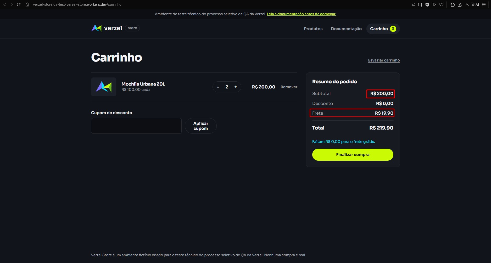
### Resultado API
**Status:** ❌ FALHOU
Ao calcular o carrinho com 2 unidades do produto `P005`, totalizando subtotal de R$ 200,00, a API manteve a cobrança de frete e indicou `freteGratis` como falso.
**Evidência:**
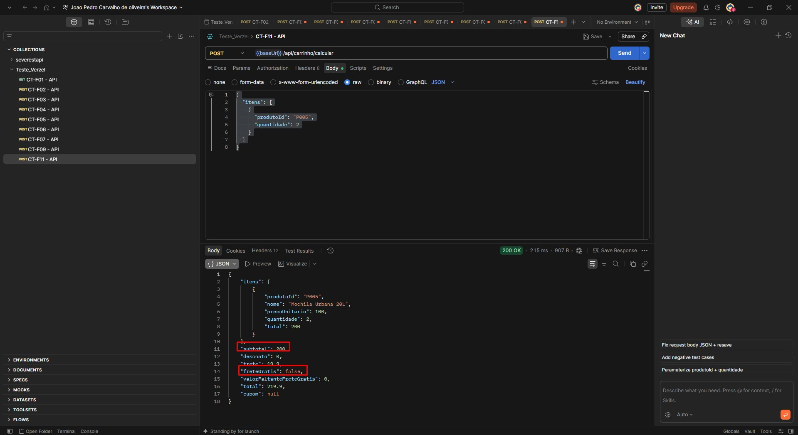
### Observações
Este cenário foi executado sem aplicação de cupom, com o objetivo de validar isoladamente a regra de frete grátis para subtotal exatamente igual a R$ 200,00.
Foi confirmada a cobrança indevida de R$ 19,90 de frete tanto na interface quanto na API, mesmo com o subtotal atingindo exatamente o valor mínimo definido para frete grátis.
Durante uma execução anterior com o cupom `BEMVINDO10`, o mesmo comportamento também havia sido observado. A execução atual demonstra que a inconsistência não depende da aplicação do desconto, mas ocorre na própria validação do limite de R$ 200,00.
O cenário com aplicação de cupom será validado novamente no CT-F14 para verificar a interação entre desconto e regra de frete.
**Evidências adicionais:**
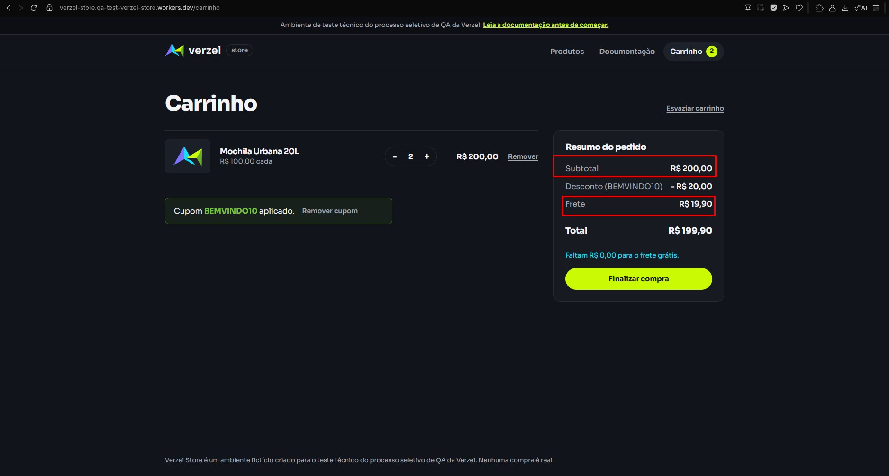
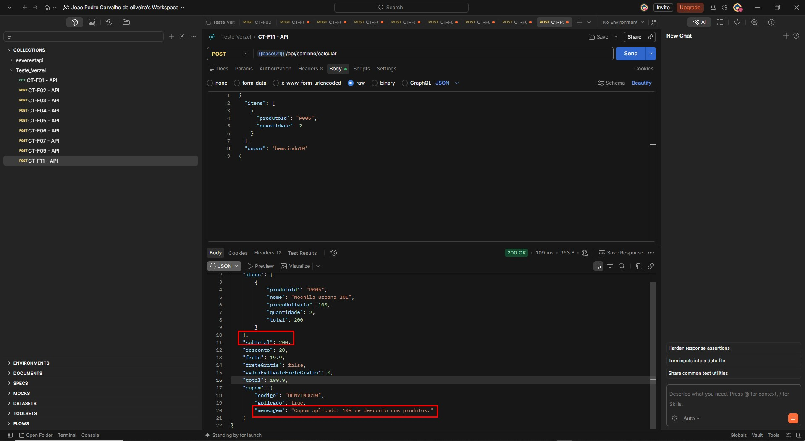
---
## CT-F12 — Validar cobrança de frete abaixo de R$ 200,00
### Resultado UI
**Status:** ✅ PASSOU
Com o carrinho totalizando subtotal inferior a R$ 200,00, o sistema aplicou corretamente o frete fixo de R$ 19,90.
A interface também informou corretamente o valor restante para atingir o frete grátis.
**Evidência:**
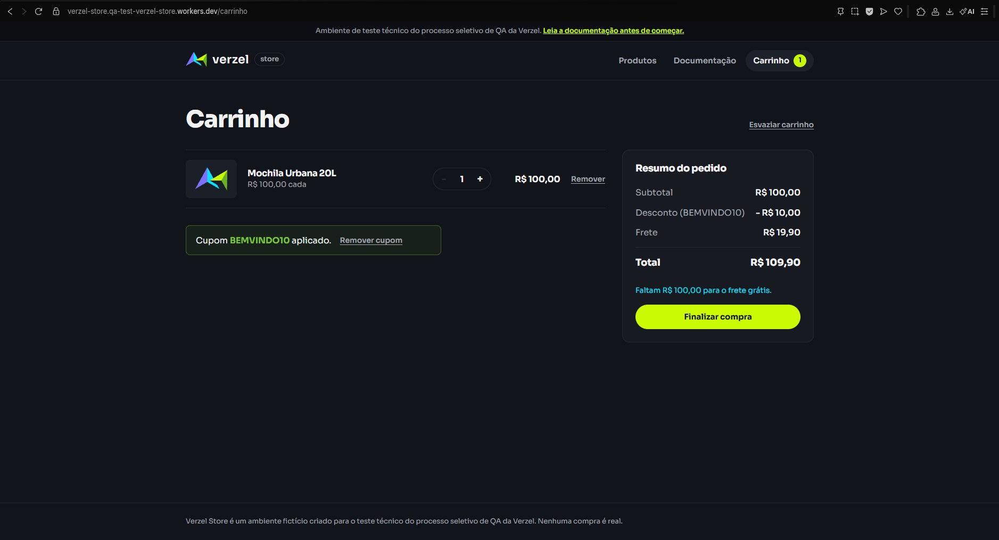
### Resultado API
**Status:** ✅ PASSOU
A API calculou corretamente o frete de R$ 19,90 para um carrinho com subtotal inferior a R$ 200,00 e retornou de forma consistente o valor faltante para atingir o frete grátis.
**Evidência:**
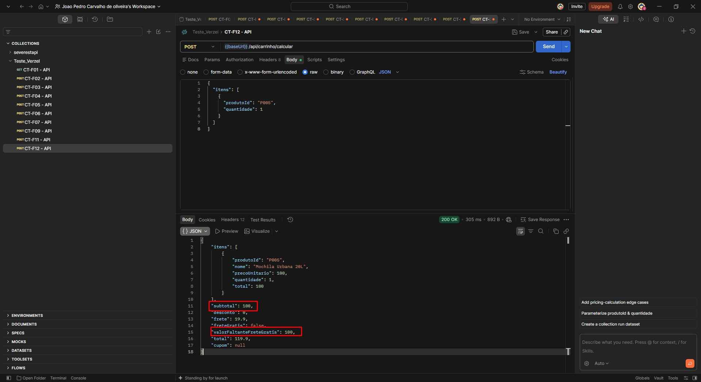
### Observações
Nenhuma divergência encontrada.
---
## CT-F13 — Validar o valor faltante para atingir o frete grátis
### Resultado UI
**Status:** ✅ PASSOU
Com o carrinho totalizando subtotal inferior a R$ 200,00, o sistema informou corretamente o valor restante necessário para atingir o frete grátis.
O valor apresentado foi compatível com a diferença entre o subtotal atual e o limite de R$ 200,00.
**Evidência:**
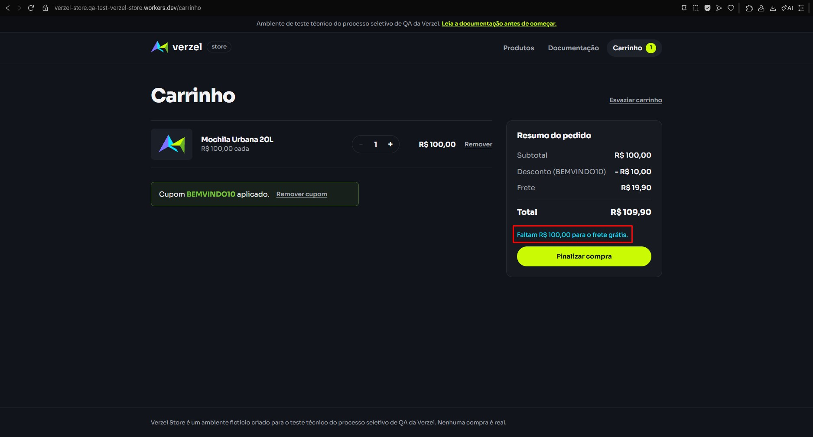
### Resultado API
**Status:** ✅ PASSOU
A API retornou corretamente o valor faltante para atingir o frete grátis, de forma consistente com o subtotal calculado.
**Evidência:**
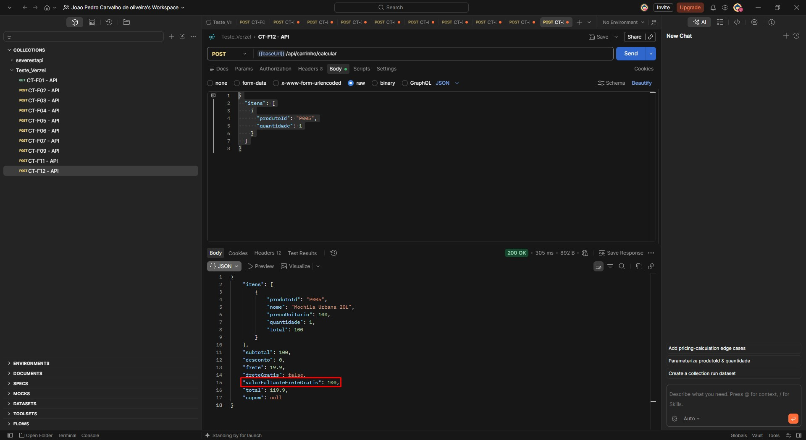
### Observações
Nenhuma divergência encontrada.
---
## CT-F14 — Manter frete grátis quando o desconto reduz o total abaixo de R$ 200,00
### Resultado UI
**Status:** ❌ FALHOU
Com o carrinho totalizando subtotal de R$ 200,00, foi aplicado o cupom `BEMVINDO10`, reduzindo o valor dos produtos em 10%.
Mesmo com o subtotal atingindo o limite mínimo para frete grátis antes da aplicação do desconto, o sistema manteve a cobrança de R$ 19,90 de frete.
**Evidência:**
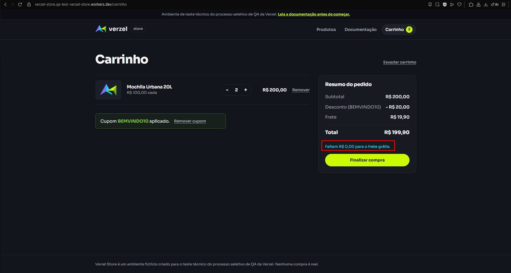
### Resultado API
**Status:** ❌ FALHOU
A API recebeu um carrinho com subtotal de R$ 200,00 e o cupom `BEMVINDO10`, porém manteve a cobrança de frete de R$ 19,90 e retornou `freteGratis` como falso.
O comportamento diverge da regra que determina que a elegibilidade para frete grátis deve considerar o subtotal antes da aplicação do desconto.
**Evidência:**
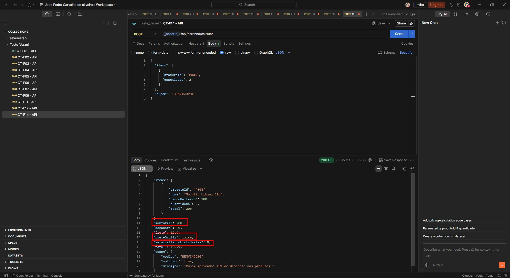
### Observações
A inconsistência já havia sido identificada durante a execução do CT-F02 e foi novamente observada no CT-F11.
No CT-F11, o mesmo comportamento ocorreu mesmo sem aplicação de cupom, demonstrando que o problema não está restrito à interação entre desconto e frete, mas também afeta a validação do limite de R$ 200,00.
Neste cenário, foi confirmado que a aplicação do cupom `BEMVINDO10` também não corrige o comportamento: o frete continua sendo cobrado mesmo com subtotal elegível ao frete grátis.
---
## CT-F15 — Validar que o desconto do cupom incide somente sobre os produtos
### Resultado UI
**Status:** ✅ PASSOU
Com o carrinho abaixo do limite de frete grátis, o cupom `BEMVINDO10` aplicou corretamente 10% de desconto somente sobre o subtotal dos produtos.
O valor do frete permaneceu inalterado, sem incidência do desconto.
**Evidência:**
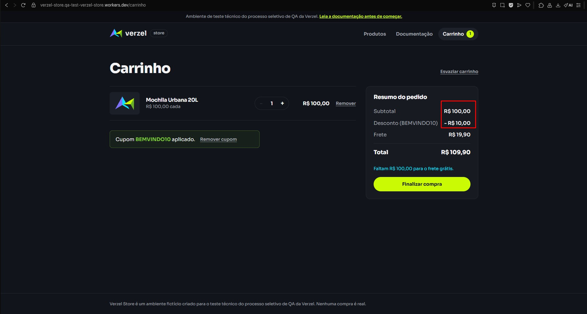
### Resultado API
**Status:** ✅ PASSOU
A API calculou corretamente o desconto apenas sobre o subtotal dos produtos e manteve o valor do frete sem desconto.
**Evidência:**
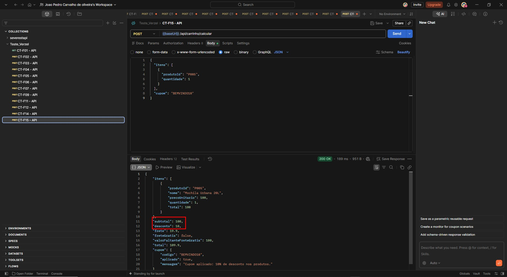
### Observações
Nenhuma divergência encontrada.
---
## CT-F16 — Adicionar exatamente cinco unidades do mesmo produto
### Resultado UI
**Status:** ✅ PASSOU
O sistema permitiu corretamente a inclusão de 5 unidades do mesmo produto no carrinho, respeitando o limite máximo definido pela regra de negócio.
**Evidência:**
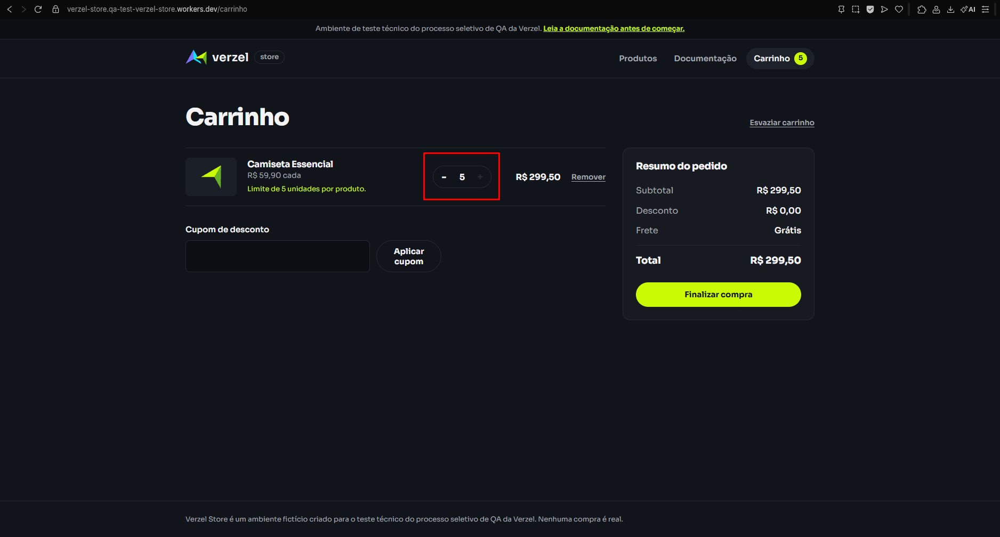
### Resultado API
**Status:** ✅ PASSOU
A API aceitou corretamente a quantidade de 5 unidades para o mesmo produto e realizou o cálculo do carrinho normalmente.
**Evidência:**
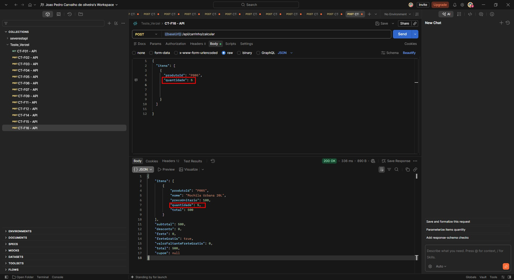
### Observações
Nenhuma divergência encontrada.
---
## CT-F17 — Tentar utilizar seis unidades do mesmo produto
### Resultado UI
**Status:** ✅ PASSOU
A interface impediu corretamente que a quantidade do produto ultrapassasse o limite máximo de 5 unidades.
**Evidência:**
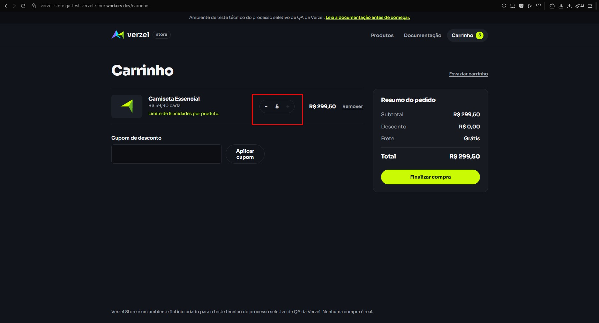
### Resultado API
**Status:** ❌ FALHOU
Ao enviar uma requisição com 6 unidades do mesmo produto, a API aceitou a quantidade informada e retornou `200 OK`, realizando normalmente o cálculo do carrinho.
O comportamento diverge da regra de negócio, que estabelece o limite máximo de 5 unidades por produto também para a API.
**Evidência:**
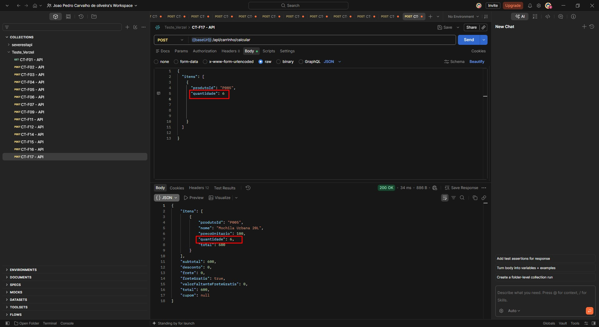
### Observações
A interface aplica corretamente a restrição de quantidade máxima, porém a mesma validação não está sendo respeitada pela API.
A API permitiu `quantidade: 6` e processou o carrinho normalmente, indicando uma inconsistência entre as validações da interface e do backend.
---
## CT-F18 — Validar arredondamento dos valores monetários
### Resultado UI
**Status:** ✅ PASSOU
Os valores monetários apresentados na interface foram exibidos de forma consistente, com duas casas decimais, incluindo subtotal, desconto, frete e total do carrinho.
**Evidência:**
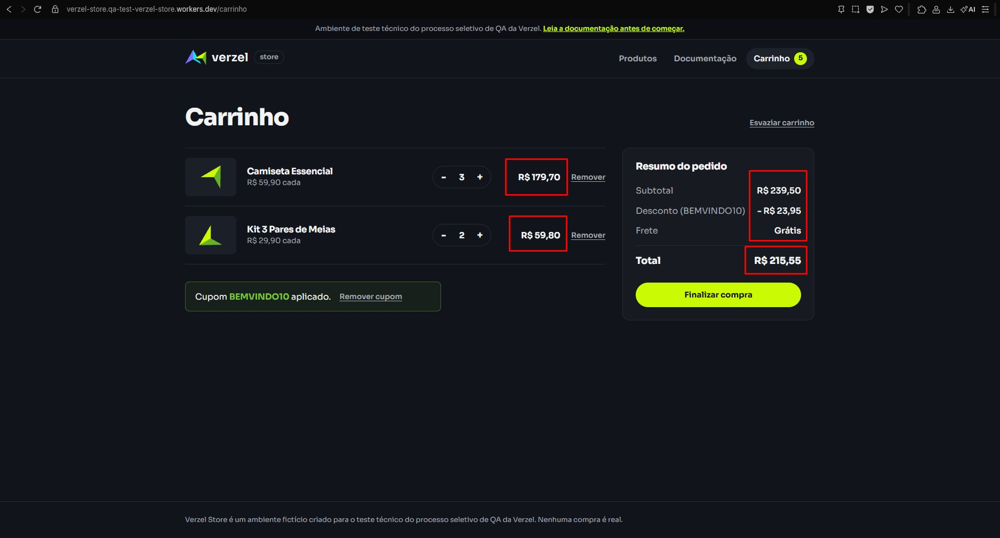
### Resultado API
**Status:** ✅ PASSOU
A API retornou os valores monetários de forma consistente com os cálculos realizados no carrinho, sem divergências de precisão nos valores validados.
**Evidência:**
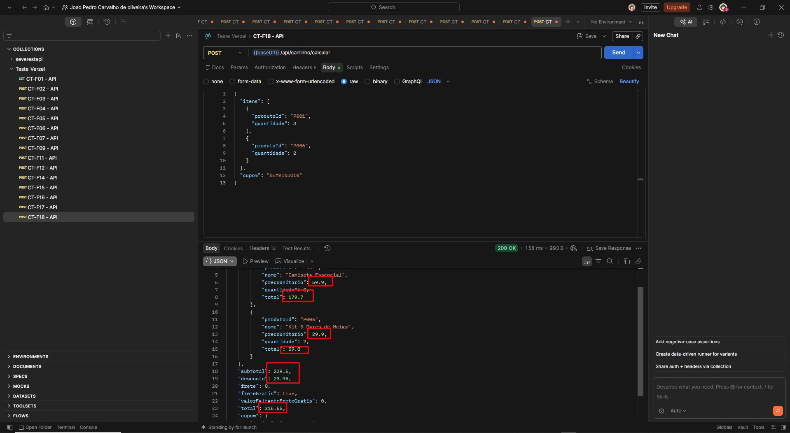
### Observações
Os preços dos produtos são fixos e as quantidades aceitas são inteiras, não sendo possível gerar, com os dados disponíveis no ambiente, um cálculo que resulte naturalmente em mais de duas casas decimais.
Dessa forma, o cenário foi utilizado para validar a consistência da apresentação e do retorno dos valores monetários com duas casas decimais.
A regra de arredondamento em situações que gerem três ou mais casas decimais não pôde ser exercitada diretamente com a massa de dados disponibilizada.
---
## CT-F19 — Validar subtotal com vários produtos e quantidades
### Resultado UI
**Status:** ✅ PASSOU
O sistema calculou corretamente o subtotal do carrinho considerando diferentes produtos e quantidades.
Os valores apresentados foram compatíveis com a soma do preço unitário multiplicado pela quantidade de cada item.
**Evidência:**
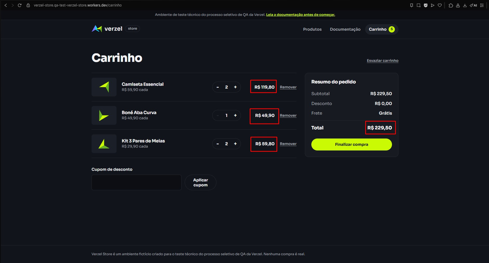
### Resultado API
**Status:** ✅ PASSOU
A API calculou corretamente o subtotal do carrinho com múltiplos produtos e quantidades diferentes, mantendo consistência com os valores apresentados na interface.
**Evidência:**
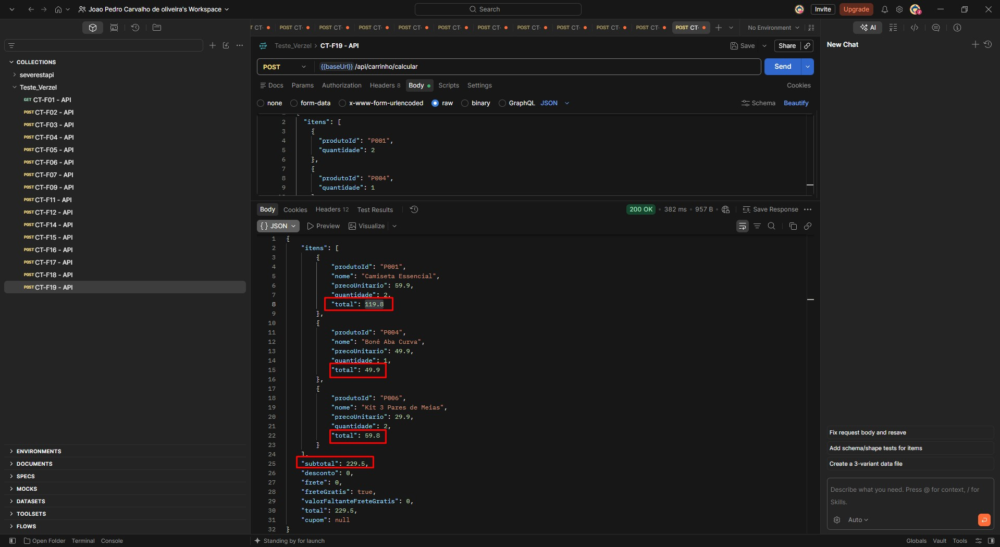
### Observações
Nenhuma divergência encontrada.
---
## CT-F20 — Validar o cálculo do total final do carrinho
### Resultado UI
**Status:** ✅ PASSOU
O sistema calculou corretamente o total final do carrinho considerando subtotal, desconto aplicado pelo cupom e valor do frete.
O valor apresentado ficou consistente com a regra de cálculo definida para o pedido.
**Evidência:**
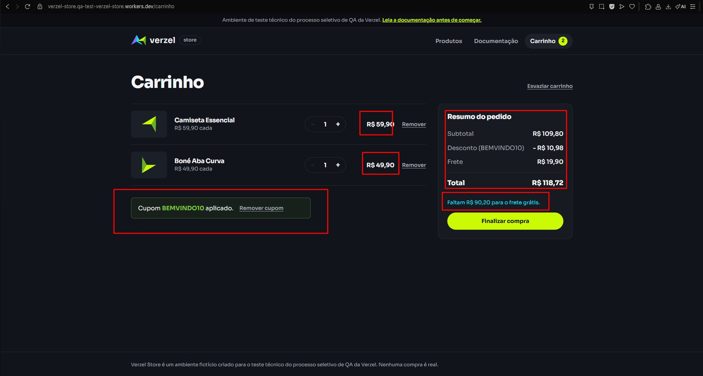
### Resultado API
**Status:** ✅ PASSOU
A API calculou corretamente o total final do carrinho, considerando o subtotal dos produtos, o desconto aplicado e o valor do frete.
Os valores retornados ficaram consistentes com os apresentados na interface.
**Evidência:**
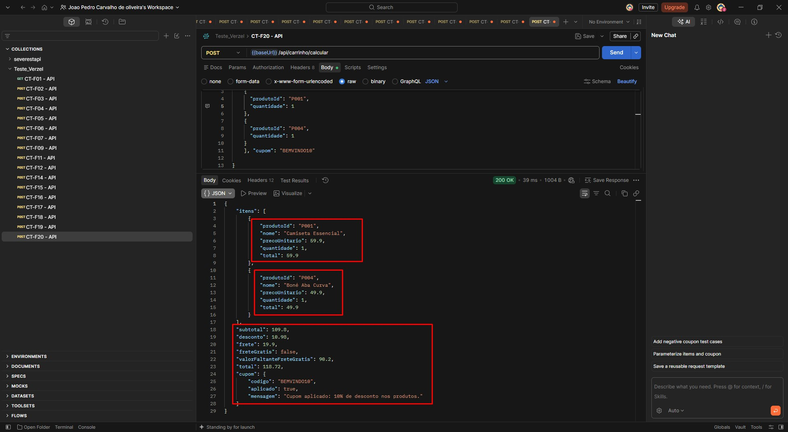
### Observações
Nenhuma divergência encontrada.
---